# ConceptOps Flow Diagram

This diagram maps the complete ConceptOps run from a rough request to a verified, usable next step. It follows the behavior defined in `conceptops/SKILL.md` and its reference documents.

## End-to-end flow

```mermaid
flowchart TD
    A([Rough request]) --> B{Work language explicit?}
    B -->|No| B1[Ask only for the work language]
    B1 --> B2([Wait for answer])
    B2 --> C
    B -->|Yes| C["Set the run-wide language contract<br/>Chat · questions · subagents · artifacts · visuals"]
    C --> C1[Explain ConceptOps in two plain sentences]
    C1 --> D{Task supplied?}
    D -->|No| D1["Ask for the task<br/>A short or messy fragment is enough"]
    D1 --> D2([Wait for task])
    D2 --> E
    D -->|Yes| E[Preserve intent and normalize the request]

    subgraph CONTEXT["1 · BUILD THE CONTEXT"]
        E --> F[Classify the task mode]
        F --> F1["New idea"]
        F --> F1B["Partial or rough idea"]
        F --> F2["Existing-project change"]
        F --> F3["Replacement or migration"]
        F --> F4["Research or technology decision"]
        F --> F5["Communication, brand, or launch"]

        F1 --> G
        F1B --> G
        F3 --> G
        F4 --> G
        F5 --> G

        F2 --> P1[Resolve the exact repository and applicable instructions]
        P1 --> P2["Trace the affected user, UI, service, data,<br/>authorization, and integration flow"]
        P2 --> P3["Find reusable helpers, patterns, components,<br/>dependencies, assets, and tests"]
        P3 --> G

        G["Build a compact context snapshot<br/>Use: user input → project evidence → current sources → labeled assumptions"]
        G --> H{Material ambiguity or trust boundary?}
        H -->|Yes| H1["Ask the smallest blocking question<br/>No more than three before a useful result<br/>Money · medical/legal · minors · sensitive data<br/>physical action · production · public deployment"]
        H1 --> H2([Wait for answer])
        H2 --> I
        H -->|No| I
        I["Separate facts, estimates, hypotheses,<br/>assumptions, opinions, and unknowns"]
        I --> J[Draft the task brief]
    end

    subgraph OUTPUTS["2 · SELECT OUTPUTS AND PREPARE THE RUN"]
        J --> K[Recommend the smallest useful component set]
        K --> L{Language, task, and outputs already explicit?}
        L -->|Yes| L1[Echo the interpreted configuration and continue]
        L -->|No| L2["Offer: recommended set · changed set · full set"]
        L2 --> L3([Wait for selection])
        L3 --> M
        L1 --> M
        M["Resolve AND / OR rules<br/>Always include summary · exclude unselected components"]
        M --> M1["Selected component contracts<br/>brief-report · presentation · website · documentation · brand-book<br/>unit-economics · research-pack · validation-kit · prototype<br/>go-to-market · solution-blueprint"]
        M1 --> N["Prepare the output location before writing<br/>Honor an explicit location, otherwise use .ideas/&lt;unique-slug&gt;/<br/>Ensure .ideas/ is ignored · never overwrite an earlier run"]
        N --> N1["Write run-manifest.md and task-brief.md<br/>Record language · mode · assumptions · components · planned files · status"]
    end

    subgraph ROUTING["3 · ROUTE EFFORT AND SUBAGENTS"]
        N1 --> O["Route each job independently<br/>fast/low · balanced/medium · strong/high<br/>Escalate only disputed or high-risk work<br/>Disclose capability substitutions"]
        O --> Q{Independent parallel work or specialist needed?}
        Q -->|No| R
        Q -->|Yes| Q1["Main agent defines independent, bounded perspectives<br/>Share the brief and source list, not full transcripts<br/>Prefix every task with the language contract"]
        Q1 --> Q2["Run within the host concurrency limit"]
        Q2 --> Q3["Each subagent returns findings · evidence · assumptions<br/>largest risk · confidence · next experiment"]
        Q3 --> Q4["Main agent resolves conflicts and owns<br/>the brief · decisions · synthesis · final artifacts"]
        Q4 --> Q5[Keep raw agent chatter out of deliverables]
        Q5 --> R
    end

    subgraph RESEARCH["4 · RESEARCH, COMPARE, AND VALIDATE"]
        R[Gather only the project and external context required by selected outputs]
        R --> S{Could an important claim have changed?}
        S -->|Yes| S1["Use current primary sources<br/>Record retrieval dates · cite claims near the claim"]
        S -->|No| S2[Use stable references and verified project evidence]
        S1 --> T
        S2 --> T

        T{Does the task require a solution choice?}
        T -->|No| U
        T -->|Yes| T1["Climb the solution ladder<br/>1. No new feature<br/>2. Existing capability<br/>3. Native platform feature<br/>4. Installed dependency<br/>5. Mature external option<br/>6. Minimal custom solution"]
        T1 --> T2["Stop at the first sufficient rung<br/>Compare correctness · safety · fit · reuse · cost<br/>accessibility · maintenance · verification · rollback"]
        T2 --> T3["For external options: at most three serious candidates<br/>Verify current facts and state decisive rejection reasons"]
        T3 --> U

        U{Does a selected artifact need visuals?}
        U -->|Yes| U1["Choose what the visual must prove<br/>real screenshot · faithful mockup · wireframe · creative concept<br/>Use authorized project visuals · label the mode"]
        U -->|No| V
        U1 --> V

        V{Is unit economics selected?}
        V -->|Yes| V1["Use editable assumptions and formulas<br/>Conservative · base · upside scenarios<br/>Show units · rationale · confidence · sensitivity"]
        V -->|No| W
        V1 --> W

        W["Find contrary evidence and the riskiest decisive assumption"]
        W --> X["Define the cheapest decisive experiment<br/>hypothesis · target · procedure · signal · pass/fail thresholds<br/>cost · duration · decision after each outcome"]
    end

    subgraph DECISION["5 · DECIDE"]
        X --> Y{What does the evidence justify?}
        Y -->|Narrow next step supported| Y1["GO"]
        Y -->|Cheap experiment can resolve the unknown| Y2["CONDITIONAL"]
        Y -->|Further investment is not justified| Y3["FREEZE"]
    end

    subgraph BUILD["6 · BUILD ONLY WHAT THE DECISION NEEDS"]
        Y1 --> Z[Build the selected artifacts]
        Y2 --> Z1["Build the selected artifacts<br/>Include the decisive experiment and thresholds"]
        Y3 --> Z2["Build decision and validation artifacts<br/>State what evidence could reopen the idea<br/>Stop costly promotional work unless explicitly requested"]

        Z --> AA
        Z1 --> AA
        Z2 --> AA
        AA["Build shared evidence, messages, calculations,<br/>tokens, charts, and images once"]
        AA --> AB["Finish independent components when another is blocked<br/>Mark blocked or skipped work instead of fabricating it"]

        AB --> AC{Would this change application code?}
        AC -->|No| AD
        AC -->|Yes| AC1{Did the user request implementation?}
        AC1 -->|No| AC2[Stop at the decision or blueprint]
        AC1 -->|Yes| AD["Preserve the current architecture<br/>Change the fewest cohesive files<br/>Leave one proportionate regression check"]
        AC2 --> AE
        AD --> AE

        AE{External write, purchase, production access, deployment, or public release?}
        AE -->|No| AF[Keep the result local]
        AE -->|Yes| AE1{Exact action already authorized?}
        AE1 -->|No| AE2([Ask before acting])
        AE2 --> AE3([Wait for authorization])
        AE3 -->|Approved| AF1[Perform only the authorized action]
        AE3 -->|Declined| AF
        AE1 -->|Yes| AF1
    end

    subgraph DELIVERY["7 · VERIFY, PERSIST, AND HAND OFF"]
        AF --> AG
        AF1 --> AG
        AG["Verify selected outputs · sources · assumptions · arithmetic<br/>editable files · rendered visuals · terminology · verdict<br/>language consistency · usability · absence of placeholders"]
        AG --> AH{All checks pass?}
        AH -->|No| AH1[Return to the relevant research, build, or verification step]
        AH1 --> AG
        AH -->|Yes| AI["Complete sources.md and run-manifest.md<br/>Keep evidence, calculations, research notes, assets,<br/>statuses, and substitutions traceable"]
        AI --> AJ["Write summary.md<br/>What · why · verdict · assumptions · usage · links<br/>limits · unresolved risks · next action"]
        AJ --> AK[Return a concise chat summary in the selected language]
        AK --> AL([Usable next step])
    end

    classDef start fill:#0B1220,stroke:#D7FF64,color:#F4F1E8,stroke-width:2px;
    classDef gate fill:#F4F1E8,stroke:#FF9D66,color:#0B1220,stroke-width:2px;
    classDef action fill:#16233B,stroke:#7AB8FF,color:#F4F1E8;
    classDef wait fill:#E8E3D5,stroke:#64748B,color:#0B1220,stroke-dasharray:4 3;
    classDef go fill:#D7FF64,stroke:#0B1220,color:#0B1220,stroke-width:2px;
    classDef conditional fill:#7AB8FF,stroke:#0B1220,color:#0B1220,stroke-width:2px;
    classDef freeze fill:#FF9D66,stroke:#0B1220,color:#0B1220,stroke-width:2px;

    class A,AL start;
    class B,D,H,L,Q,S,T,U,V,Y,AC,AC1,AE,AE1,AH gate;
    class B2,D2,H2,L3,AE2,AE3 wait;
    class Y1 go;
    class Y2 conditional;
    class Y3 freeze;
    class C,C1,D1,E,F,F1,F1B,F2,F3,F4,F5,G,H1,I,J,K,L1,L2,M,M1,N,N1,O,P1,P2,P3,Q1,Q2,Q3,Q4,Q5,R,S1,S2,T1,T2,T3,U1,V1,W,X,Z,Z1,Z2,AA,AB,AC2,AD,AF,AF1,AG,AH1,AI,AJ,AK action;
```

## Source map

- Start, language contract, operating rules, effort routing, subagents, decision loop, persistence, and delivery: [`conceptops/SKILL.md`](./conceptops/SKILL.md)
- Context modes, evidence order, task brief, and question policy: [`context-and-brief.md`](./conceptops/references/context-and-brief.md)
- Component selection, artifact contracts, and branching behavior: [`output-components.md`](./conceptops/references/output-components.md)
- Repository discovery, solution ladder, visual modes, and implementation boundary: [`project-decisions.md`](./conceptops/references/project-decisions.md)
- Research integrity, decision gate, experiments, economics, and final verification: [`validation-and-economics.md`](./conceptops/references/validation-and-economics.md)

The diagram summarizes these documents. The linked files remain the normative instructions.
