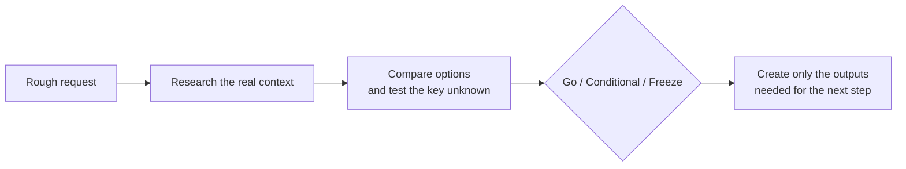

<p align="center">
  
</p>

<h1 align="center">ConceptOps</h1>

<p align="center">
  <strong>Make the idea earn the build.</strong><br>
  From a rough request to a researched decision and the files needed to act on it.
</p>

<p align="center">
  <a href="https://github.com/uginy/conceptops/releases"></a>
  <a href="https://agentskills.io/specification"></a>
  <a href="#compatibility"></a>
  <a href="#compatibility"></a>
  <a href="#compatibility"></a>
  <a href="./LICENSE"></a>
  <a href="./evals/scenarios.md"></a>
  
</p>

<p align="center">
  <a href="#see-the-difference">Demo</a> |
  <a href="#the-route">Workflow</a> |
  <a href="./FLOW_DIAGRAM.md">Flow diagram</a> |
  <a href="#output-components">Outputs</a> |
  <a href="#compatibility">Compatibility</a> |
  <a href="#install">Install</a> |
  <a href="#examples">Examples</a> |
  <a href="#evaluation">Evaluation</a>
</p>

<p align="center">
  
</p>

ConceptOps is an open Agent Skill for product discovery, feature planning, technology evaluation, market research, feasibility checks, unit economics, validation, prototyping, documentation, presentations, websites, brand systems, and visual concepts.

Give it a short, messy request. It finds the relevant context, separates facts from assumptions, compares realistic options, tests the key unknowns, makes a decision, and creates only the outputs needed for the next step.

Install the same portable skill in OpenAI Codex, Claude Code, or GitHub Copilot. There is no hosted service to trust, account to create, or runtime dependency to maintain.

## See the difference

### You provide

```text
offline search. private. 20k markdown notes. no cloud.
what should we use? implementation can wait.
```

### ConceptOps turns it into

```text
Mode:       technology decision
Goal:       choose a private local search approach
Constraints: one laptop, no cloud, no always-running service

Compare:    current project -> native features -> installed tools
            -> mature libraries -> minimal custom work

Decision:   Go / Conditional / Freeze
Proof:      a measurable retrieval-quality experiment
Outputs:    task brief + solution blueprint + sources + usage summary
```

No invented requirements. No five-layer architecture. No polished landing page before the idea has earned one.

## The route



<p align="center">
  <a href="./FLOW_DIAGRAM.md"><strong>Detailed flow diagram</strong></a>
</p>

1. **Ask:** choose the work language and accept the request as written.
2. **Map:** inspect the project, market, technology, evidence, and constraints that matter.
3. **Compare:** climb from reuse and native features to external libraries and minimal custom work.
4. **Validate:** mark facts, estimates, hypotheses, and assumptions; test the riskiest unknown.
5. **Decide:** return `Go`, `Conditional`, or `Freeze`.
6. **Make:** create only the selected outputs and explain how to use them.

Every run is saved under `.ideas/<slug>/` with a task brief, source list, selected artifacts, and short usage summary.

## Built for real work

- **Messy input is expected.** A fragment is enough to begin.
- **Existing projects come first.** ConceptOps reads the real codebase, instructions, dependencies, patterns, and affected flow before recommending a change.
- **Reuse beats invention.** It checks current capabilities, native platform features, and installed dependencies before adding anything.
- **Current claims need current sources.** Prices, regulations, competitors, libraries, and benchmarks are researched instead of guessed.
- **Facts stay separate from assumptions.** Calculations use formulas; unsupported precision is rejected.
- **Effort follows risk.** Stronger models, deeper reasoning, and specialist subagents are used only where they can change the decision.
- **External actions stay gated.** Production deployment, purchases, and public release require explicit authorization.

## Output components

Choose one component or combine several with AND/OR semantics. ConceptOps recommends the smallest useful set after it understands the task.

| Component | What it leaves behind |
| --- | --- |
| Brief report | Evidence, risks, verdict, and next action |
| Presentation | Editable decision narrative |
| Website | Landing page source and local preview |
| Documentation | Product, technical, API, user, or operations documents |
| Brand book | Positioning, voice, visual direction, and reusable tokens |
| Unit economics | Editable assumptions, scenarios, formulas, and sensitivity |
| Research pack | Sourced market, customer, competitor, or technology evidence |
| Validation kit | Hypotheses, experiments, thresholds, and kill criteria |
| Prototype | Wireframe, faithful mockup, or interactive concept |
| Go-to-market | Segment, positioning, channels, experiments, and metrics |
| Solution blueprint | Project-grounded implementation options and recommendation |

Every package includes `summary.md`: what was created, why it exists, how to use it, what remains uncertain, and what to do next.

## Compatibility

ConceptOps works as a native Agent Skill in:

| Host | Status | Surfaces | Version |
| --- | --- | --- | --- |
| [OpenAI Codex](https://learn.chatgpt.com/docs/build-skills) | First-class | App, CLI, and IDE extension | Current stable |
| [Claude Code](https://code.claude.com/docs/en/skills) | First-class | CLI and IDE integrations | 2.0.20 or newer |
| [GitHub Copilot](https://docs.github.com/en/copilot/concepts/agents/about-agent-skills) | First-class | Cloud agent, code review, CLI, app, VS Code, and JetBrains | Current stable |

ConceptOps uses the portable core of the open Agent Skills specification: a `SKILL.md` file, YAML metadata, relative references, and bundled assets. It does not depend on host-specific hooks, subagent fields, or shell permissions. The optional `agents/openai.yaml` file adds presentation metadata in Codex and is ignored by other hosts.

No single minimum version is published across every Codex and GitHub Copilot surface, so current stable releases are recommended. Claude Code added Skills support in `2.0.20`.

## Install

### All three hosts

Install ConceptOps globally for Codex, Claude Code, and GitHub Copilot:

```bash
npx skills add uginy/conceptops -g -a codex -a claude-code -a github-copilot
```

The command is provided by the open [`skills`](https://github.com/vercel-labs/skills) CLI. Use `npx skills add uginy/conceptops --list` to inspect the skill before installing it.

### Codex

```bash
npx skills add uginy/conceptops -g -a codex
```

Invoke with `$conceptops` or select it from `/skills`.

### Claude Code

```bash
npx skills add uginy/conceptops -g -a claude-code
```

Invoke with `/conceptops` or let Claude load it when the request matches.

### GitHub Copilot

```bash
npx skills add uginy/conceptops -g -a github-copilot
```

Invoke with `/conceptops` in Copilot CLI or let Copilot load it when relevant.

### Manual install

Copy the [`conceptops/`](./conceptops/) directory into the host's personal or project skills folder:

| Host | Personal | Project |
| --- | --- | --- |
| Codex | `~/.agents/skills/conceptops` | `.agents/skills/conceptops` |
| Claude Code | `~/.claude/skills/conceptops` | `.claude/skills/conceptops` |
| GitHub Copilot | `~/.copilot/skills/conceptops` | `.github/skills/conceptops` |

Restart the host only if the newly installed skill does not appear.

## Examples

```text
Use $conceptops. English. Maybe a tiny service that helps independent cafés
predict tomorrow's pastry waste? I don't know if owners would use another app.
Give me the smallest useful package.
```

```text
Use $conceptops. Work in English. The filtering screen in this inventory app is
slow and confusing. Decide whether we should replace the current table library.
I need a solution blueprint AND a low-fidelity prototype, but no code changes.
```

```text
Use $conceptops. English. Need private semantic search across roughly 20,000
Markdown notes on one laptop. No cloud and no always-running service. Help me
choose an approach; implementation can wait.
```

See the complete synthetic examples:

- [Rough product idea](./examples/rough-product-idea.md)
- [Existing-project change](./examples/existing-project-change.md)
- [Technology decision](./examples/technology-decision.md)

## Visual modes

ConceptOps chooses the visual mode by what the artifact needs to prove:

1. A real screenshot with a tutorial overlay for exact current behavior.
2. A project-faithful mockup for a realistic product extension.
3. A structural wireframe for flow or layout.
4. A creative or AAA concept when the task calls for open visual exploration.

It can match an existing product closely without forcing every creative task into the current UI style.

## Evaluation

[`evals/scenarios.md`](./evals/scenarios.md) contains three compact synthetic scenarios:

- rough request and output restraint;
- existing-project reuse and scope boundaries;
- language consistency and AND/OR component selection.

These are behavioral contracts, not claims of universal model performance. The skill structure is also checked with the validator bundled with OpenAI's Skill Creator.

## Repository layout

```text
conceptops/
├── assets/
├── conceptops/
│   ├── agents/openai.yaml
│   ├── references/
│   └── SKILL.md
├── FLOW_DIAGRAM.md
├── evals/
├── examples/
├── LICENSE
├── README.md
└── SECURITY.md
```

## Security and privacy

ConceptOps is instruction-only and has no backend or telemetry. The skill still treats external writes, public release, production access, private data, money, medical or legal decisions, minors, and physical actions as explicit trust boundaries.

Report vulnerabilities through GitHub's private vulnerability reporting. See [SECURITY.md](./SECURITY.md).

## License

MIT. See [LICENSE](./LICENSE).
